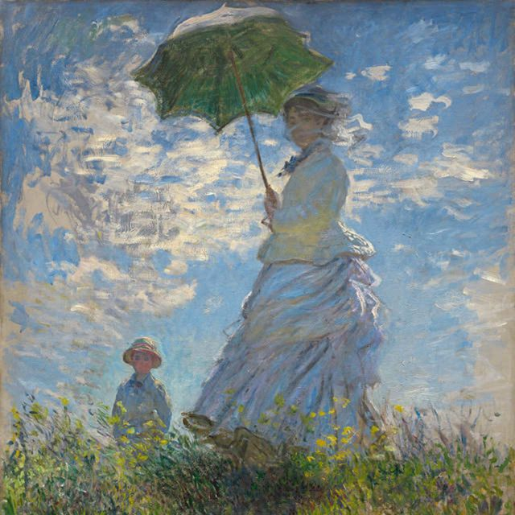
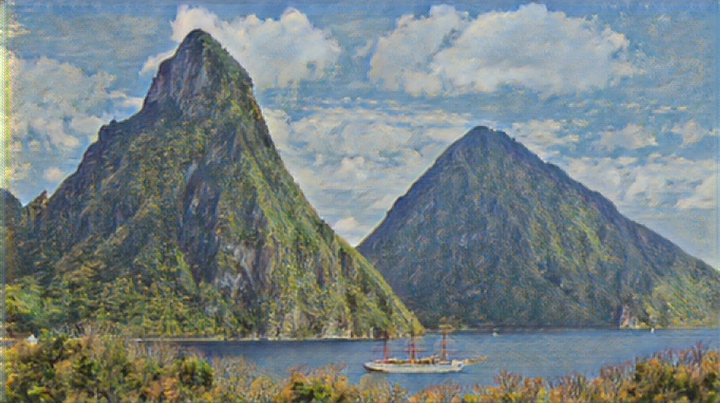
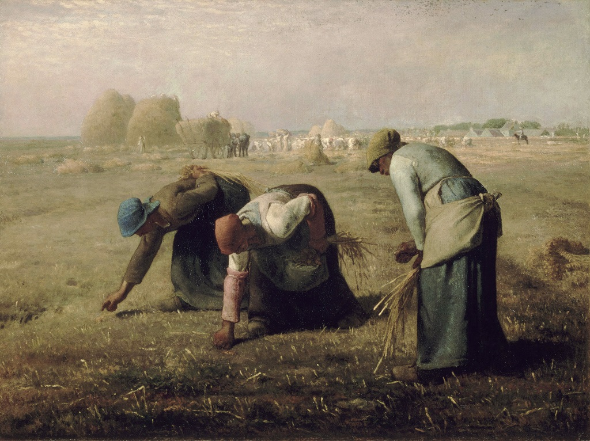
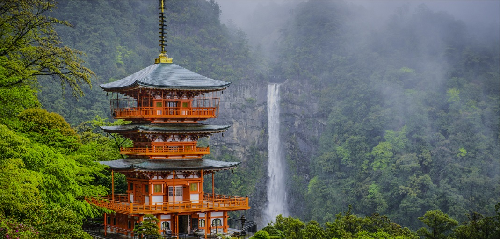
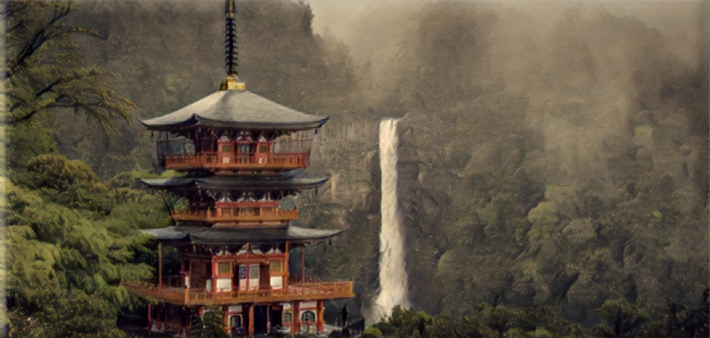
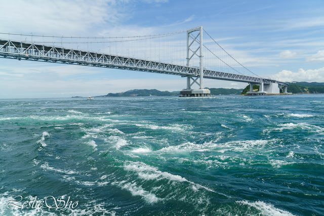
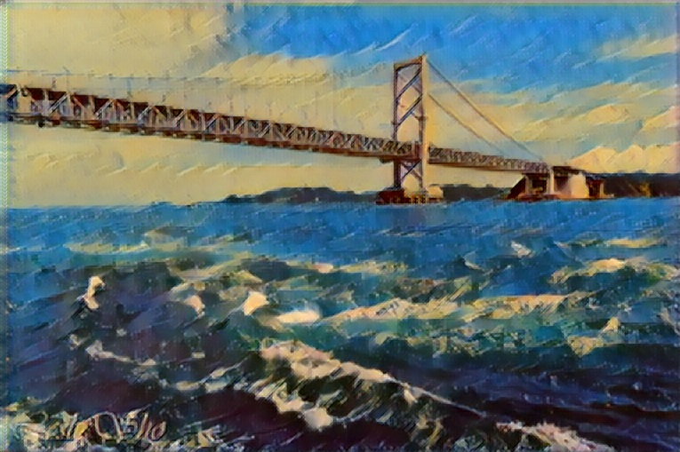
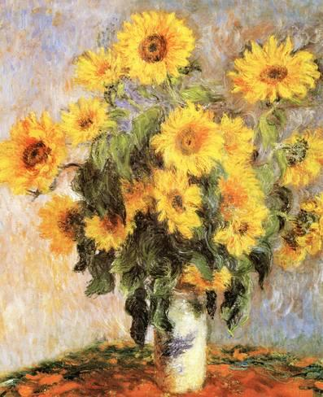
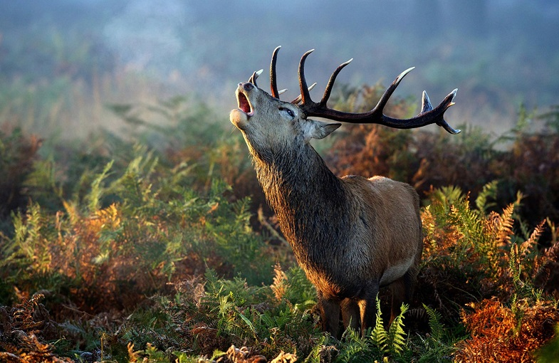
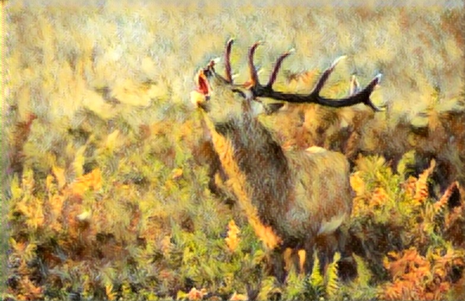

# Stylebank

Implementation of the paper: [StyleBank: An Explicit Representation for Neural Image Style Transfer](https://arxiv.org/abs/1703.09210)

# Implemented
* Training
* Incremental Learning

# Training
1. Prepare your content image dataset (I use MS-COCO)
2. Prepare your style image dataset

It takes about 1 days to train on a GeForce GTX 1080 Ti
# Examples

Style | Source | Transfered
:--:|:--:|:--:
 |  | 
 |  | 
 |  | 
 |  | 
 |  | 
